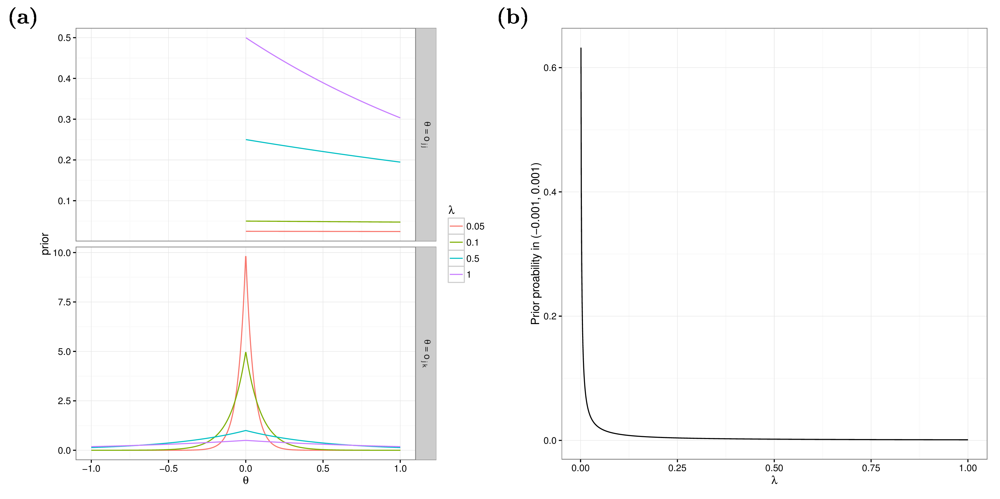
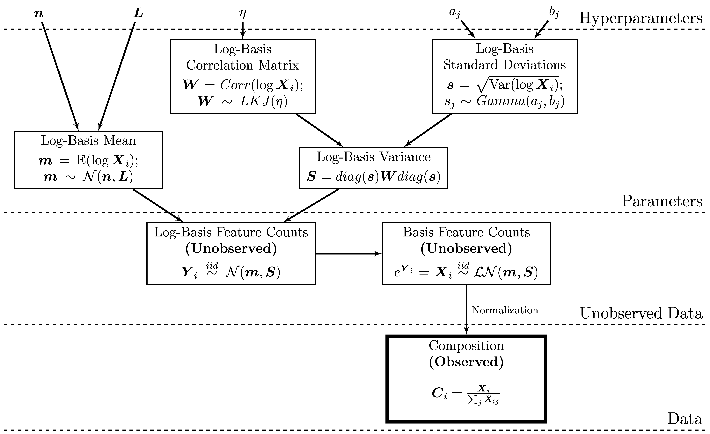

## Introduction

Compositional data occur in many disciplines: geology, nutrition,
economics, and ecology, to name a few. Data are compositional when
each sample is sum-constrained. For example, mineral compositions
describe a mineral in terms of the weight percentage coming from
various elements; or taxonomic compositions break down a community by
the fraction of community memebers that come from a particular
species. In ecology in particular, the covariance between features is
often of interest to determine which species possibly interact with
each other. However, the sum constraint of compositional data makes
naive measures inappropriate.

BAnOCC is a package for analyzing compositional covariance while
accounting for the compositional structure. Briefly, the model assumes
that the unobserved counts are log-normally distributed and then
infers the correlation matrix of the log-basis (see the [The Model]
section for a more detailed explanation). The inference is made using
No U-Turn Sampling for Hamiltonian Monte Carlo [@HoffmanAndGelman2014]
as implemented in the `rstan` R package [@StanSoftware2015].

## How To Install
There are three options for installing BAnOCC:

* Within R
* Using compressed file from bitbucket
* Directly from bitbucket

### From Within R 
**This is not yet available**
```{r, eval=FALSE, echo=FALSE}
source("https://bioconductor.org/biocLite.R")
biocLite("BAnOCC")
```

### From Bitbucket (Compressed File)
**This is not yet available**

### From Bitbucket (Directly) 

Clone the repository using `git clone`, which downloads the package as
its own directory called `banocc`.

```bash 
git clone https://<your-user-name>@bitbucket.org/biobakery/banocc.git
```

Then, install BAnOCC's dependencies. If these are already installed on
your machine, this step can be skipped.

```bash
Rscript -e "install.packages(c('rstan', 'mvtnorm', 'coda', 'stringr'))"
```

Lastly, install BAnOCC using `R CMD INSTALL`. Note that this _will
not_ automatically install the dependencies, so they must be installed
first.

```bash 
R CMD INSTALL banocc
```

## How To Run

### Loading
We first need to load the package:
```{r load, eval=TRUE}
library(banocc)
```

### Package Features
The BAnOCC package contains four things:

* `banocc_model`, which is the BAnOCC model in the  `rstan` format
* `run_banocc`, a wrapper function for `rstan::sampling` that samples
  from the model and returns a list with various useful elements
* `get_banocc_output`, which takes as input a `stanfit` object outputted by
  `run_banocc`, and outputs various statistics from the chains.
* Several test datasets which are included both as counts and as the
  corresponding compositions:

    Dataset Description           | Counts             | Composition
    ----------------------------- | ------------------ | ------------
    No correlations in the counts | `counts_null`      | `compositions_null`
    No correlations in the counts | `counts_hard_null` | `compositions_hard_null`
    Positive corr. in the counts  | `counts_pos_spike` | `compositions_pos_spike`
    Negative corr. in the counts  | `counts_neg_spike` | `compositions_neg_spike`


### Data and Prior Input 

For a full and complete description of the possible parameters for
`run_banocc` and `get_banocc_output`, their default values, and the
output, see

```{r run-banocc-help, eval=FALSE} 
?run_banocc 
?get_banocc_output
```

#### Required Input

There are only two required inputs to `run_banocc`:

1. The dataset `C`. This is assumed to be $N \times P$, with $N$
samples and $P$ features. The row sums are therefore required to be
less than one for all samples.
1. The compiled stan model `compiled_banocc_model`. The compiled model is
required so that `run_banocc` doesn't need to waste time compiling the
model every time it is called. To compile, use
`rstan::stan_model(model_code=banocc::banocc_model)`.

The simplest way to run the model is to load a test dataset, compile
the model, sample from it (this gives a warning because the
default number of iterations is low), and get the output:

```{r rerun, cache=TRUE, echo=FALSE}
rerun <- 0
```

```{r basic-run-banocc, eval=TRUE, cache=TRUE, dependson=c('rerun'), results="hide"}
data(compositions_null)
compiled_banocc_model <- rstan::stan_model(model_code = banocc::banocc_model) 
b_fit     <- banocc::run_banocc(C = compositions_null, compiled_banocc_model=compiled_banocc_model)
b_output <- banocc::get_banocc_output(banoccfit=b_fit)
```


#### Hyperparameters

The hyperparameter values can be specified as input to
`run_banocc`. Their names correspond to the parameters in the plate
diagram figure (see section [The Model]). For example,

```{r input-hyperparameters, eval=TRUE, cache=TRUE, dependson=c('rerun'), results="hide"} 
p <- ncol(compositions_null)
b_fit_hp <- banocc::run_banocc(C = compositions_null, 
                               compiled_banocc_model = compiled_banocc_model,
                               n = rep(0, p),
                               L = 10 * diag(p), 
                               a = 0.5,
                               b = 0.01)
```

### Sampling Control

There are several options to control the behavior of the HMC sampler
within `run_banocc`. This is simply a call to `rstan::sampling`, and
so many of the parameters are the same.

#### General Sampling Control

The number of chains, iterations, and warmup iterations as well as the
rate of thinning for `run_banocc` can be specified using the same
parameters as for `rstan::sampling` and `rstan::stan`. For example,
the following code gives a total of three iterations from each of two
chains. These parameters are used only for brevity and are NOT
recommended in practice.

```{r sampling-sampling, eval=TRUE, cache=TRUE, dependson=c('rerun'), results="hide"}
b_fit_sampling <- banocc::run_banocc(C = compositions_null,
                                     compiled_banocc_model = compiled_banocc_model,
                                     chains = 2,
                                     iter = 11,
                                     warmup = 5,
                                     thin = 2)
```

#### Number of Cores

The number of cores used for sampling on a multi-processor machine can
also be specified, which allows chains to run in parallel and
therefore decreases computation time. Since its purpose is running
chains in parallel, computation time will decrease as cores are added
up to when the number of cores and the number of chains are equal.

```{r sampling-cores, eval=FALSE}
# This code is not run
b_fit_cores <- banocc::run_banocc(C = compositions_null,
                                  compiled_banocc_model = compiled_banocc_model,
                                  chains = 2,
                                  cores = 2)
```

#### Initial Values

By default, the initial values for **$m$** and $\lambda$ are sampled
from the priors and the initial values for **$O$** are set to the
identity matrix of dimension $P$. Setting the initial values for
**$O$** to the identity helps ensure a parsimonious model fit. The
initial values can also be set to a particular value by using a list
whose length is the number of chains and whose elements are lists of
initial values for each parameter:

```{r sampling-init, eval=TRUE, cache=TRUE, dependson=c('rerun'), results="hide"}
init <- list(list(m = rep(0, p),
                  O = diag(p),
                  lambda = 0.02),
             list(m = runif(p),
                  O = 10 * diag(p),
                  lambda = runif(1, 0.1, 2)))
b_fit_init <- banocc::run_banocc(C = compositions_null,
                                 compiled_banocc_model = compiled_banocc_model,
                                 chains = 2,
                                 init = init)
```

More specific control of the sampler's behavior comes from the
`control` argument to `rstan::sampling`. Details about this argument
can be found in the help for the `rstan::stan` function:

```{r, eval=FALSE}
?stan
```

### Output Control

There are several parameters that control the type of output which is
returned by `get_banocc_output`.

#### Credible Interval Width

The width of the returned credible intervals is controlled by
`conf_alpha`. A $100\% * (1-\alpha_\text{conf})$ credible interval is
returned:

```{r output-ci, eval=TRUE, cache=TRUE, dependson=c('rerun'), results="hide"}
# Get 90% credible intervals
b_out_90 <- banocc::get_banocc_output(banoccfit=b_fit,
                                      conf_alpha = 0.1)
# Get 99% credible intervals
b_out_99 <- banocc::get_banocc_output(banoccfit=b_fit,
                                      conf_alpha = 0.01)
```

#### Checking Convergence

Convergence is evaluated automatically, and in this case the credible
intervals, estimates, and any additional output in section [Additional
Output] is missing. This behavior can be turned off using the
`eval_convergence` option. But be careful!

```{r eval-convergence, eval=TRUE, cache=TRUE, dependson=c('rerun'), results="hide"}
# Default is to evaluate convergence
b_out_ec <- banocc::get_banocc_output(banoccfit=b_fit)

# This can be turned off using `eval_convergence`
b_out_nec <- banocc::get_banocc_output(banoccfit=b_fit,
                                       eval_convergence = FALSE)
```

```{r show-eval-convergence, eval=TRUE}
# Iterations are too few, so estimates are missing
b_out_ec$Estimates.median

# Convergence was not evaluated, so estimates are not missing
b_out_nec$Estimates.median
```

#### Additional Output

Two types of output can be requested for each correlation that are not
included by default:

1. The smallest credible interval width that includes zero
1. The scaled neighborhood criterion, or SNC [@LiAndLin2010]

```{r output-extra, eval=TRUE, cache=TRUE, dependson=c('rerun'), results="hide"}
# Get the smallest credible interval width that includes zero
b_out_min_width <- banocc::get_banocc_output(banoccfit=b_fit,
                                             get_min_width = TRUE)

# Get the scaled neighborhood criterion
b_out_snc <- banocc::get_banocc_output(banoccfit=b_fit,
                                       calc_snc = TRUE)
```

Detailed statements about the function's execution can also be printed
using the `verbose` argument. The relative indentation of the verbose
output indicates the nesting level of the function. The starting
indentation can be set with `num_level`.

## Assessing Convergence

There are many ways of assessing convergence, but the two most easily
implemented using BAnOCC are:

1. Traceplots of parameters, which show visually what values of a
parameter have been sampled across all iterations. At convergence, the
sampler should be moving rapidly across the space, and the chains
should overlap well. In other words, it should look like grass.

1. The Rhat statistic [@GelmanAndRubin1992], which measures agreement
between all the chains. It should be close to one at convergence.

### Traceplots

Traceplots can be directly accessed using the `traceplot` function in
the `rstan` package, which creates a `ggplot2` object that can be
further maniuplated to 'prettify' the plot. The traceplots so
generated are for the samples drawn _after_ the warmup period. For
example, we could plot the traceplots for the inverse covariances of
feature 1 with all other features. There is overlap between some of
the chains, but not all and so we conclude that we need more samples
from the posterior to be confident of convergence.

```{r traceplot, eval=TRUE, cache=TRUE}
# The inverse covariances of feature 1 with all other features
rstan::traceplot(b_fit$Fit, pars=paste0("O[1,", 2:9, "]"))
```

We could also see the warmup period samples by using
`inc_warmup=TRUE`. This shows that some of the chains have moved from
very different starting points to a similar distribution, which is a
good sign of convergence.

```{r traceplot-warmup, eval=TRUE, cache=TRUE}
# The inverse covariances of feature 1 with all other features, including warmup
rstan::traceplot(b_fit$Fit, pars=paste0("O[1,", 2:9, "]"),
                 inc_warmup=TRUE)
```

### Rhat Statistics

The Rhat values can also be directly accessed using the `summary`
function in the `rstan` package. It measures the degree of agreement
between all the chains. At convergence, the Rhat statistics should be
approximately one for all parameters. For example, the Rhat values for
the correlation between feature 1 and all other features (the same as
those plotted above), agree with the traceplots that convergence has
not yet been reached.

```{r Rhat, eval=TRUE, cache=TRUE}
# This returns a named vector with the Rhat values for all parameters
rhat_all <- rstan::summary(b_fit$Fit)$summary[, "Rhat"]

# To see the Rhat values for the inverse covariances of feature 1
rhat_all[paste0("O[1,", 2:9, "]")]
```

## Choosing Priors

The hyperparameters for the model (see section [The Model]) need to be
chosen appropriately.

### Log-Basis Precision Matrix

The prior on the precision matrix **$O$** is a GLASSO prior from
[@Wang2012] with parameter $\lambda$ [see also section [The
Model]]. As $\lambda$ decreases, the degree of shrinkage
correspondingly increases.



```{r, eval=FALSE, echo=FALSE}
# The above plot is from Dropbox/hutlab/Emma/paper1/writeup/figures/supplemental/lambbda_behavior.png
```

### Log-Basis Mean

We recommend using an uninformative prior for the log-basis mean:
centered at zero and with large variance.

### GLASSO Shrinkage Parameter

We recommend using a prior with large probability mass close to zero;
because $\lambda$ has a gamma prior, this means that the shape
parameter $a$ should be less than one. The rate parameter $b$
determines the variability; in cases with either small (order of 10)
or very large ($p > n$) numbers of features $b$ should be large so
that the variance of the gamma distribution, $a / b^2$, is
small. Otherwise, a small value of $b$ will make the prior more
uninformative.

## The Model

A pictoral representation of the model is shown below. Briefly, the
basis (or unobserved, unrestricted counts) for each sample is assumed
to be a lognormal distribution with parameters **$m$** and
**$S$**. The prior on **$m$** is a normal distribution parametrized by
mean **$n$** and variance-covariance matrix **$L$**. Since we are
using a graphical LASSO prior, we parametrize the model with precision
matrix **$O$**. The prior on **$O$** is a graphical LASSO prior
[@Wang2012] with shrinkage parameter $\lambda$. To circumvent the
necessity of choosing $\lambda$, a gamma hyperprior is placed on
$\lambda$, with parameters $a$ and $b$.





If we print the model, we can actually see the code. It is written in
the format required by the `rstan` package, since `banocc` uses this
package to sample from the model. See [@StanManual2015] for more
detailed information on this format.

```{r model, eval=FALSE}
# This code is not run
cat(banocc::banocc_model)
```

## References