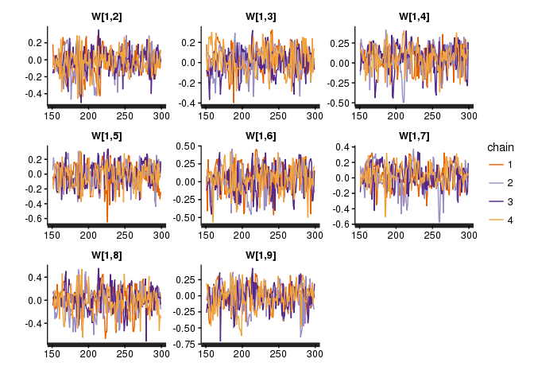
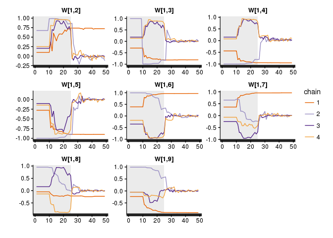

Introduction to BAnOCC (Bayesian Analaysis Of Compositional Covariance)
================
Emma Schwager
2016-07-07

-   [Introduction](#introduction)
-   [How To Install](#how-to-install)
    -   [From Within R](#from-within-r)
    -   [From Bitbucket (Compressed File)](#from-bitbucket-compressed-file)
    -   [From Bitbucket (Directly)](#from-bitbucket-directly)
-   [How To Run](#how-to-run)
    -   [Data and Prior Input](#data-and-prior-input)
        -   [Required Input](#required-input)
        -   [Hyperparameters](#hyperparameters)
    -   [Sampling Control](#sampling-control)
        -   [General Sampling Control](#general-sampling-control)
        -   [Number of Cores](#number-of-cores)
        -   [Initial Values](#initial-values)
    -   [Output Control](#output-control)
        -   [Credible Interval Width](#credible-interval-width)
        -   [Additional Output](#additional-output)
-   [Assessing Convergence](#assessing-convergence)
    -   [Traceplots](#traceplots)
    -   [Rhat Statistics](#rhat-statistics)
-   [Choosing Priors](#choosing-priors)
-   [The Model](#the-model)
-   [References](#references)

Introduction
------------

Compositional data occur in many disciplines: geology, nutrition, economics, and ecology, to name a few. Data are compositional when each sample is sum-constrained. For example, mineral compositions describe a mineral in terms of the weight percentage coming from various elements; or taxonomic compositions break down a community by the fraction of individuals that come from a particular species. In ecology in particular, the covariance between features is often of interest to determine which species possibly interact with each other. However, the sum constraint of compositional data makes naive measures inappropriate.

BAnOCC is a package for analyzing compositional covariance while accounting for the compositional structure. Briefly, the model assumes that the unobserved counts are log-normally distributed and then infers the correlation matrix of the log-basis (see [The Model](#the-model) section for a more detailed explanation). The inference is made using No U-Turn Sampling for Hamiltonian Monte Carlo (Hoffman and Gelman 2014) as implemented in the `rstan` R package (Stan Development Team 2015b).

How To Install
--------------

There are three options for installing BAnOCC:

-   Within R
-   Using compressed file from bitbucket
-   Directly from bitbucket

### From Within R

**This is not yet available**

### From Bitbucket (Compressed File)

**This is not yet available**

### From Bitbucket (Directly)

``` bash
git clone https://<your-user-name>@bitbucket.org/biobakery/banocc.git
R CMD INSTALL banocc
```

How To Run
----------

We first need to load the package:

``` r
library(banocc)
```

    ## Loading required package: rstan

    ## Loading required package: ggplot2

    ## Loading required package: StanHeaders

    ## rstan (Version 2.10.1, packaged: 2016-06-24 13:22:16 UTC, GitRev: 85f7a56811da)

    ## For execution on a local, multicore CPU with excess RAM we recommend calling
    ## rstan_options(auto_write = TRUE)
    ## options(mc.cores = parallel::detectCores())

The BAnOCC package contains three things:

-   `bayesStanModel`, which is the BAnOCC model in the `rstan` format
-   `run_banocc`, a wrapper function for `rstan::sampling` that samples from the model and returns a list with various useful elements
-   Several test datasets which are included both as counts and as the corresponding compositions:

    | Dataset Description           | Counts             | Composition              |
    |-------------------------------|--------------------|--------------------------|
    | No correlations in the counts | `counts_null`      | `compositions_null`      |
    | No correlations in the counts | `counts_hard_null` | `compositions_hard_null` |
    | Positive corr. in the counts  | `counts_pos_spike` | `compositions_pos_spike` |
    | Negative corr. in the counts  | `counts_neg_spike` | `compositions_neg_spike` |

The simplest way to run the model is to load the test dataset, compile the model, and sample from it:

``` r
data(compositions_null)
banocc_model <- rstan::stan_model(model_code = banocc::banocc_model) 
b_output     <- banocc::run_banocc(C = compositions_null, banocc_model=banocc_model)
```

For a full and complete description of the possible parameters for `run_banocc`, their default values, and the output, see

``` r
?run_banocc 
```

### Data and Prior Input

#### Required Input

There are only two required inputs to `run_banocc`:

1.  The dataset `C`. This is assumed to be *n* × *p*, with *n* samples and *p* features. The row sums are therefore required to be less than one for all samples.
2.  The compiled stan model `banocc_model`. The compiled model is required so that `run_banocc` doesn't need to waste time compiling the model every time it is called. To compile, use `rstan::stan_model(model_code=banocc::banocc_model)`.

#### Hyperparameters

The hyperparameter values can be specified as input. Their names correspond to the parameters in the plate diagram figure (see section [The Model](#the-model)). For example,

``` r
p <- ncol(compositions_null)
b_hp <- banocc::run_banocc(C = compositions_null, 
                           banocc_model = banocc_model,
                           n = rep(0, p),
                           L = 10 * diag(p), 
                           a = rep(1,   p),
                           b = rep(0.5, p),
                           eta = 1)
```

The hyperparameter values for ***s***, the standard deviations of the log-transformed basis, can be alternatively specified as the means and variances of the prior using the parameters `sd_mean` and `sd_var`. This is because the mean of a Gamma distribution is *a*<sub>*j*</sub>/*b*<sub>*j*</sub>, and the variance is *a*<sub>*j*</sub>/*b*<sub>*j*</sub><sup>2</sup>. For example,

``` r
# This is the same prior as above
b_sd_mean <- banocc::run_banocc(C = compositions_null,
                                banocc_model = banocc_model,
                                sd_mean = rep(2, p),
                                sd_var  = rep(4, p))
```

### Sampling Control

There are several options to control the behavior of the HMC sampler. This is simply a call to `rstan::sampling`, and so many of the parameters are the same.

#### General Sampling Control

The number of chains, iterations, and warmup iterations as well as the rate of thinning can be specified using the same parameters as for `rstan::sampling` and `rstan::stan`. For example, the following code gives a total of three iterations from each of two chains. These parameters are used only for brevity and are NOT recommended in practice.

``` r
b_sampling <- banocc::run_banocc(C = compositions_null,
                                 banocc_model = banocc_model,
                                 chains = 2,
                                 iter = 11,
                                 warmup = 5,
                                 thin = 2)
```

#### Number of Cores

The number of cores used for sampling on a multi-processor machine can also be specified, which allows chains to run in parallel and therefore decreases computation time. Since its purpose is running chains in parallel, computation time will decrease as cores are added up to when the number of cores and the number of chains are equal.

``` r
# This code is not run
b_cores <- banocc::run_banocc(C = compositions_null,
                              banocc_model = banocc_model,
                              chains = 2,
                              cores = 2)
```

#### Initial Values

The initial values are sampled from the priors by default because the positive definite constraint on the covariance matrix makes it difficult for `rstan::sampling` to generate initial values automatically. They can also be set to a particular value by using a list. `WChol` is the cholesky decomposition of ***W*** that is used by the sampler for computational reasons.

``` r
init <- list(list(m = rep(0, p),
                  WChol = t(chol(diag(p))),
          s = rep(1, p)),
             list(m = runif(p),
                  WChol = t(chol(2 * diag(p))),
                  s = runif(p, 0.1, 2)))
b_init <- banocc::run_banocc(C = compositions_null,
                             banocc_model = banocc_model,
                             chains = 2,
                             init = init)
```

More specific control of the sampler's behavior comes from the `control` argument to `rstan::sampling`. Details about this argument can be found in the help for the `rstan::stan` function:

``` r
?stan
```

### Output Control

There are several parameters that control the type of output which is returned.

#### Credible Interval Width

The width of the returned credible intervals is controlled by `conf_alpha`. A 100%\*(1 − *α*<sub>conf</sub>) credible interval is returned:

``` r
# Get 90% credible intervals
b_90 <- banocc::run_banocc(C = compositions_null,
                           banocc_model = banocc_model,
                           conf_alpha = 0.1)
# Get 99% credible intervals
b_99 <- banocc::run_banocc(C = compositions_null,
                           banocc_model = banocc_model,
                           conf_alpha = 0.01)
```

#### Additional Output

Two types of output can be requested for each correlation that are not included by default:

1.  The smallest credible interval width that includes zero
2.  The scaled neighborhood criterion, or SNC (Li and Lin 2010)

``` r
# Get the smallest credible interval width that includes zero
b_min_width <- banocc::run_banocc(C = compositions_null,
                                  banocc_model = banocc_model,
                                  get_min_width = TRUE)

# Get the scaled neighborhood criterion
b_snc <- banocc::run_banocc(C = compositions_null,
                            banocc_model = banocc_model,
                            calc_snc = TRUE)
```

Detailed statements about the function's execution can also be printed using the `verbose` argument. The relative indentation of the verbose output indicates the nesting level of the function. The starting indentation can be set with `num_level`.

Assessing Convergence
---------------------

There are many ways of assessing convergence, but the two most easily implemented using BAnOCC are:

1.  Traceplots of parameters, which show visually what values of a parameter have been sampled across all iterations. At convergence, the sampler should be moving rapidly across the space, and the chains should overlap well. In other words, it should look like grass.

2.  The Rhat statistic (Gelman and Rubin 1992), which measures agreement between all the chains. It should be close to one at convergence.

### Traceplots

Traceplots can be directly accessed using the `traceplot` function in the `rstan` package, which creates a `ggplot2` object that can be further maniuplated to 'prettify' the plot. The traceplots so generated are for the samples drawn *after* the warmup period. For example, we could plot the traceplots for the correlations of feature 1 with all other features. There is good overlap between the chains, but we need more samples from the posterior to be confident of convergence.

``` r
# The correlations of feature 1 with all other features
rstan::traceplot(b_output$Fit, pars=paste0("W[1,", 2:9, "]"))
```



We could also see the warmup period samples by using `inc_warmup=TRUE`. This shows that the chains have moved from very different starting points to a similar distribution, which is a good sign of convergence.

``` r
# The correlations of feature 1 with all other features, including warmup
rstan::traceplot(b_output$Fit, pars=paste0("W[1,", 2:9, "]"),
                 inc_warmup=TRUE)
```



### Rhat Statistics

The Rhat values can also be directly accessed using the `summary` function in the `rstan` package. It measures the degree of agreement between all the chains. At convergence, the Rhat statistics should be approximately one for all parameters. For example, the Rhat values for the correlation between feature 1 and all other features (the same as those plotted above), agree with the traceplots that convergence has not yet been reached.

``` r
# This returns a named vector withthe Rhat values for all parameters
rhat_all <- rstan::summary(b_output$Fit)$summary[, "Rhat"]

# To see the Rhat values for the correlations of feature 1
rhat_all[paste0("W[1,", 2:9, "]")]
```

    ##   W[1,2]   W[1,3]   W[1,4]   W[1,5]   W[1,6]   W[1,7]   W[1,8]   W[1,9] 
    ## 2.383395 1.988170 2.828204 2.203286 2.606121 2.160999 2.781550 2.049964

Choosing Priors
---------------

**Coming Soon!**

The Model
---------

A pictoral representation of the model is shown below. Briefly, the basis (or unobserved, unrestricted counts) for each sample is assumed to be a lognormal distribution with parameters ***m*** and ***S***. The prior on ***m*** is a normal distribution parametrized by mean ***n*** and variance-covariance matrix ***L***. Since we are interested in the correlation structure, we break ***S*** into a correlation matrix ***W*** and a vector of standard deviations ***s***. The prior on ***W*** is an LKJ distribution (Lewandowski, Kurowicka, and Joe 2009) with shrinkage parameter *η*, while the prior on eash *s*<sub>*j*</sub> is a gamma prior with shape *a*<sub>*j*</sub> and rate *b*<sub>*j*</sub>.


If we print the model, we can actually see the code. It is written in the format required by the `rstan` package, since `banocc` uses this package to sample from the model. See (Stan Development Team 2015a) for more detailed information on this format.

``` r
# This code is not run
cat(banocc::banocc_model)
```

References
----------

Gelman, Andrew, and Donald B. Rubin. 1992. “Inference from Iterative Simulation Using Multiple Sequences.” *Statistical Science* 7 (4). Institute of Mathematical Statistics: 457–72. <http://dx.doi.org/10.2307/2246093>.

Hoffman, Matthew D., and Andrew Gelman. 2014. “The No-U-Turn Sampler: Adaptively Setting Path Lengths in Hamiltonian Monte Carlo.” *J. Mach. Learn. Res.* 15 (1). JMLR.org: 1593–1623. <http://dl.acm.org/citation.cfm?id=2627435.2638586>.

Lewandowski, Daniel, Dorota Kurowicka, and Harry Joe. 2009. “Generating Random Correlation Matrices Based on Vines and Extended Onion Method.” *Journal of Multivariate Analysis* 100 (9): 1989–2001. <http://dx.doi.org/10.1016/j.jmva.2009.04.008>.

Li, Qing, and Nan Lin. 2010. “The Bayesian Elastic Net.” *Bayesian Anal.* 5 (1). International Society for Bayesian Analysis: 151–70. <http://dx.doi.org/10.1214/10-BA506>.

Stan Development Team. 2015a. *Stan Modeling Language Users Guide and Reference Manual, Version 2.10.0*. <http://mc-stan.org/>.

———. 2015b. “Stan: A C++ Library for Probability and Sampling, Version 2.10.0.” <http://mc-stan.org/>.
